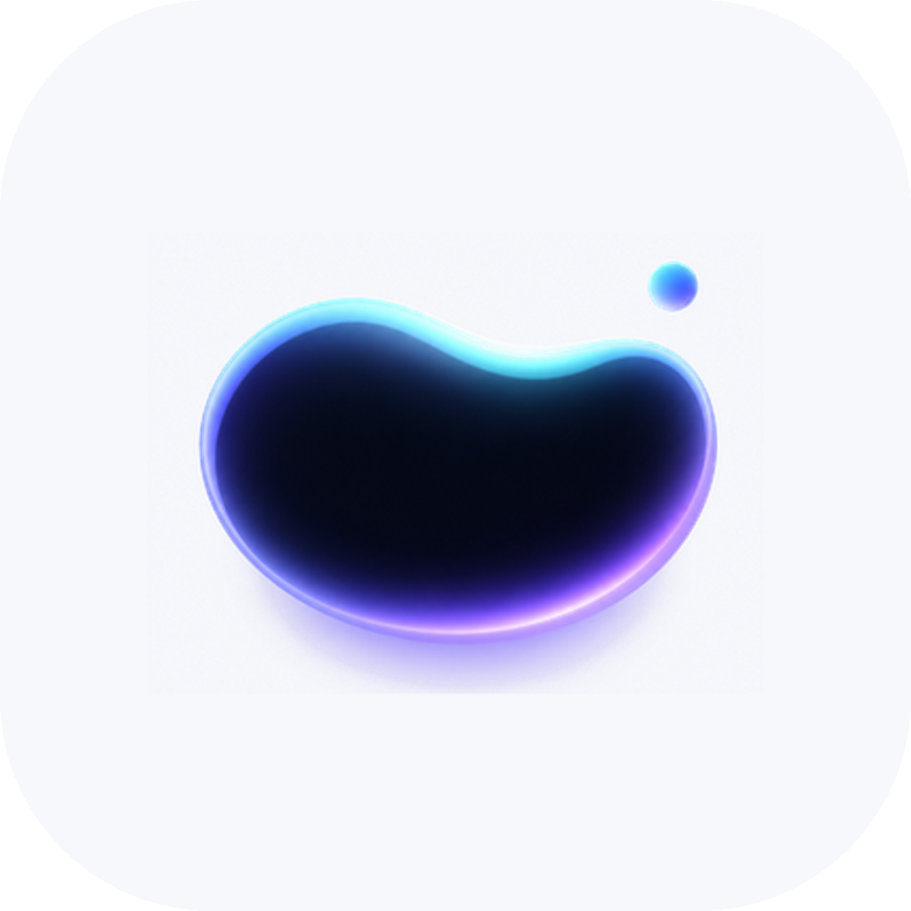

<p align="center">
  
</p>

<h1 align="center">流体胶囊 · FluidCapsule</h1>

<p align="center">
  <strong>让 Android 通知在 ColorOS 上变成真正可交互的流体胶囊。</strong><br>
  <strong>Turn Android notifications into truly interactive capsules on ColorOS.</strong>
</p>

Turn Android notifications into interactive capsules on supported ColorOS devices.

将 Android 通知转换为可交互的 ColorOS 流体云胶囊，包括验证码提取、通知白名单、邮箱“仅验证码上云”、原通知跳转和快捷回复。

> [!IMPORTANT]
> FluidCapsule is an independent, unofficial open-source project. It is not affiliated with or endorsed by OPPO, ColorOS, Telegram, WeChat, or any other app vendor.
>
> FluidCapsule 是独立的非官方开源项目，与 OPPO、ColorOS、Telegram、微信或其他应用厂商不存在隶属、授权或背书关系。

## Features / 功能

### English

- Listen for notifications from user-selected apps.
- Optionally keep a local notification history. Choose a retention period in days, months, or years, or keep it forever. Turning recording off never deletes existing entries; history can be browsed by time or by folded app groups ordered by notification count.
- Extract one-time passwords from SMS notifications and display the code directly.
- Copy an OTP by tapping its capsule, with an optional masked clipboard preview.
- Mirror whitelisted notifications with the original app icon, sender avatar, title, and message.
- Rebuild the observed sequence of successive WeChat and QQ summary updates so multiple messages remain visible in order while the listener stays connected.
- Keep up to eight pending capsule events in memory. Newer messages preempt the visible slot, while valid earlier messages return after the current event is opened, acted on, removed, or timed out.
- Open the source notification and, when it exposes Android `RemoteInput`, forward reply and mark-as-read actions.
- Add `Open reply` for actionless WeChat/QQ messages and a distinct trash-icon `Close` action that also dismisses the matching source notification from the notification shade.
- Show one-tap smart replies and adapt the reply panel accent color to the source app icon.
- Choose a light, dark, or system-following app appearance.
- Turn LocalSend transfers and Meituan order updates into progress-aware capsules while filtering recognized Meituan promotions.
- Reformat Speedtest's final `Test Complete` notification so download and upload results remain visible on one line.
- Configure every user-facing setting through an ADB-friendly CLI, including per-app rules and history retention.
- Keep notification processing available with explicit foreground-service and accessibility options.

### 中文

- 监听用户主动选择的应用通知。
- 可选保存本地通知历史；可按天、月、年设置保留期，也可永久保存。关闭记录不会删除已有内容，支持按时间浏览或按应用通知次数折叠分组。
- 从短信通知中提取一次性验证码并直接显示。
- 点击胶囊复制验证码，并可选择隐藏剪贴板预览中的敏感内容。
- 使用原应用图标、发送者头像、标题和正文镜像白名单通知。
- 在监听器保持连接时，按顺序重建微信和 QQ 连续摘要更新中已观察到的多条消息。
- 在内存中保留最多 8 个待展示事件；新消息可抢占当前胶囊，有效的旧消息会在当前事件被打开、处理、移除或超时后恢复。
- 打开原通知；当来源提供 Android `RemoteInput` 时，转发回复和标记已读操作。
- 为没有原生 action 的微信/QQ 消息提供“打开回复”，并提供带独立垃圾桶图标的“关闭”，同时从下拉通知栏撤销对应来源通知。
- 提供一键智能回复，并根据来源应用图标调整回复面板的强调色。
- 支持浅色、深色或跟随系统的应用外观。
- 将 LocalSend 传输和美团订单更新转换为带进度的胶囊，同时过滤已识别的美团推广通知。
- 重新整理 Speedtest 最终 `Test Complete` 通知，使下载与上传结果能在一行内完整显示。
- 通过适合 ADB 使用的 CLI 配置全部用户设置，包括单应用规则和历史保留期。
- 提供明确的前台服务与无障碍保活选项，帮助通知处理持续运行。

## Platform support / 平台支持

### English

- Supported device: OPPO CPH2797 running Android 16 / API 36.
- Verified firmware baseline: `CPH2797_16.0.9.400(EX01)`.
- Promoted/live notifications must be enabled. ColorOS owns the final capsule rendering and may change it in a firmware update.

FluidCapsule 1.x intentionally sets `minSdk = 36`. Older Android versions and other OEM devices are outside the supported scope.

### 中文

- 支持设备：运行 Android 16 / API 36 的 OPPO CPH2797。
- 已验证固件基线：`CPH2797_16.0.9.400(EX01)`。
- 必须启用实时通知提升/流体云通知。最终胶囊由 ColorOS 渲染，系统固件更新可能改变其行为。

FluidCapsule 1.x 有意将 `minSdk` 设为 36；旧版 Android 和其他厂商设备不在支持范围内。

## Privacy model / 隐私模型

### English

FluidCapsule processes notification text locally. The app does not request internet access and does not upload notification content. OTPs and reply text are not written to diagnostic logs. When notification history is enabled, captured text follows the selected day, month, year, or forever policy and can be deleted by entry, app, or in full. Turning recording off does not delete existing entries.

Read [Privacy and security](docs/PRIVACY.md) before enabling notification access, history, or accessibility features.

### 中文

FluidCapsule 在设备本地处理通知文本，不申请联网权限，也不会上传通知内容。验证码和回复文本不会写入诊断日志。启用通知历史后，已捕获文本遵循用户选择的天、月、年或永久保留策略，并可按单条、应用或全部删除；关闭记录本身不会删除已有历史。

启用通知访问、历史记录或无障碍功能前，请阅读[隐私与安全说明](docs/PRIVACY.md)。

## Storage estimate / 存储体积估算

### English

On the verified OPPO snapshot from 11 August 2026, 758 notification records occupied 663,552 bytes (0.63 MiB) in the SQLite database, or about 875 bytes per record including the current indexes and allocated pages. Using the current seven-day count as a steady-rate approximation gives about 108 records per day.

| Retention horizon | Approximate records | Linear database estimate | Conservative planning allowance |
| --- | ---: | ---: | ---: |
| 1 year | 39,500 | 33 MiB | about 50 MiB |
| 3 years | 118,500 | 99 MiB | about 150 MiB |
| 10 years | 395,000 | 330 MiB | about 500 MiB |

At the current volume, even permanent retention is unlikely to cause severe database growth. Notification volume and message length can change, and SQLite may keep allocated pages after records are deleted, so these figures are capacity estimates rather than a storage guarantee. The more important trade-off for permanent retention is privacy: old notification text remains readable on the device until it is manually deleted or app data is cleared.

### 中文

在 2026 年 8 月 11 日验证的 OPPO 快照中，758 条通知记录占用 663,552 字节（0.63 MiB）的 SQLite 数据库空间；把现有索引和已分配页面都算进去，平均约 875 字节/条。以当前 7 天记录量近似为稳定速率，约为每天 108 条。

| 保留时长 | 预计记录数 | 线性数据库估算 | 保守预留空间 |
| --- | ---: | ---: | ---: |
| 1 年 | 39,500 | 33 MiB | 约 50 MiB |
| 3 年 | 118,500 | 99 MiB | 约 150 MiB |
| 10 年 | 395,000 | 330 MiB | 约 500 MiB |

按照目前的通知量，即使选择永久保存，也不太可能造成非常严重的数据库膨胀。通知数量和正文长度以后可能变化，而且 SQLite 删除记录后可能继续保留已分配页面，因此这些数字是容量估算，并非存储承诺。永久保存更需要注意的是隐私：旧通知正文会一直留在设备上，直到手动删除或清除应用数据。

## Build / 构建

### Requirements / 环境要求

- Android SDK 36
- JDK 21
- Android platform-tools（用于 ADB 命令 / for ADB commands）

Build, test, lint, and install the debug APK / 构建、测试、Lint 并安装 debug APK：

```bash
./gradlew testDebugUnitTest assembleDebug assembleDebugAndroidTest lintDebug
adb install -r app/build/outputs/apk/debug/app-debug.apk
```

Run the seven CPH2797 instrumentation checks / 运行 7 项 CPH2797 仪器测试：

```bash
adb -s SERIAL install -r -t app/build/outputs/apk/androidTest/debug/app-debug-androidTest.apk
adb -s SERIAL shell am instrument -w \
  io.github.venompool888.fluidcapsule.test/androidx.test.runner.AndroidJUnitRunner
./scripts/verify-cph2797.sh --serial SERIAL
```

The signed release build uses a keystore outside the repository and a password stored in macOS Keychain.

正式签名构建使用仓库外的 keystore，密码存放在 macOS 钥匙串中。

```bash
./scripts/build-release.sh
```

The output is `app/build/outputs/apk/release/app-release.apk`. APKs and signing material are intentionally excluded from Git.

输出文件为 `app/build/outputs/apk/release/app-release.apk`。APK 与签名材料均有意排除在 Git 仓库之外。

## Initial setup / 初始设置

### English

1. Install and open FluidCapsule.
2. Grant notification-listener and notification-posting access.
3. Select trusted source apps in the notification whitelist.
4. Allow promoted/live notifications for FluidCapsule on the supported ColorOS version.
5. Optionally enable the explicit keep-alive controls if the system stops the listener in the background.

### 中文

1. 安装并打开 FluidCapsule。
2. 授予通知读取与通知发布权限。
3. 在通知白名单中选择可信的来源应用。
4. 在受支持的 ColorOS 版本上允许 FluidCapsule 使用实时通知提升/流体云通知。
5. 如果系统会在后台停止监听服务，可按需启用明确提供的保活选项。

For repeatable device configuration, see [ADB CLI](docs/CLI.md).

如需可重复执行的设备配置流程，请参阅 [ADB CLI](docs/CLI.md)。

## How it works / 工作原理

```text
Source notification / explicitly supported foreground status
来源通知 / 明确支持的前台状态
        ↓
NotificationListenerService / package-scoped accessibility adapter
通知监听服务 / 限定应用包的无障碍适配器
        ↓
Normalize → OTP parser / known-app adapter / whitelist policy
标准化 → 验证码解析器 / 已知应用适配器 / 白名单策略
        ↓
CapsuleEvent / 胶囊事件
        ↓
In-memory priority queue → one visible capsule slot
内存优先级队列 → 单个可见胶囊槽位
        ↓
Android 16 promoted ongoing notification
Android 16 实时提升的持续通知
```

More detail is available in [Architecture](docs/ARCHITECTURE.md) and [ColorOS notes](docs/COLOROS.md).

更多细节请参阅[架构说明](docs/ARCHITECTURE.md)和 [ColorOS 说明](docs/COLOROS.md)。

## Important limitations / 重要限制

### English

- Direct reply is possible only when the source notification supplies a valid `RemoteInput` action. FluidCapsule cannot invent a private sending API for another app.
- Smart replies are sent immediately when tapped. Manually typed replies still require the Send button.
- OEM live-notification behavior can change between ColorOS releases.
- Version 1.x supports only CPH2797 on the verified Android 16 firmware baseline.
- Accessibility UI automation for apps without native reply actions is not implemented. The optional accessibility service does not read screen content.
- The project does not include third-party APKs, decompiled source, proprietary assets, private protocols, or account-bypass features.

### 中文

- 只有来源通知提供有效的 `RemoteInput` 操作时才能直接回复；FluidCapsule 无法凭空创建其他应用的私有发送接口。
- 点击智能回复会立即发送；手动输入的回复仍需点击发送按钮。
- 不同 ColorOS 版本可能改变厂商实时通知行为。
- 1.x 仅支持经过验证的 Android 16 固件基线上的 CPH2797。
- 尚未为不提供原生回复操作的应用实现无障碍界面自动化；可选无障碍服务不会读取屏幕内容。
- 项目不包含第三方 APK、反编译源码、专有素材、私有协议或绕过账号安全的功能。

## Quality gate / 质量门

### English

- Local JUnit suite: 52 tests.
- CPH2797 instrumentation suite: 7 tests, including action fallback structure, continuous history scrolling, and system notification queue preemption/restoration.
- Required build gate: unit tests, debug APK, instrumentation APK, and Android lint with no findings.
- GitHub Actions runs unit tests, the debug build, and lint for every push to `main` and every pull request.

### 中文

- 本地 JUnit 测试：52 项。
- CPH2797 仪器测试：7 项，包括 action 兜底结构、历史页连续滚动容器以及系统通知队列的抢占/恢复。
- 必须通过的构建门槛：单元测试、debug APK、仪器测试 APK，以及零问题的 Android Lint。
- 每次推送到 `main` 或创建 Pull Request 时，GitHub Actions 都会运行单元测试、debug 构建和 Lint。

## Contributing / 参与贡献

Bug reports and pull requests are welcome. Remove notification text, OTPs, usernames, avatars, device serials, and local paths from logs or screenshots before posting. See [CONTRIBUTING.md](CONTRIBUTING.md).

欢迎提交问题报告和 Pull Request。公开日志或截图前，请移除通知正文、验证码、用户名、头像、设备序列号和本地路径。详见 [CONTRIBUTING.md](CONTRIBUTING.md)。

## License / 许可证

[MIT](LICENSE) © 2026 FluidCapsule contributors.

本项目以 [MIT 许可证](LICENSE)开源，版权所有 © 2026 FluidCapsule contributors。
